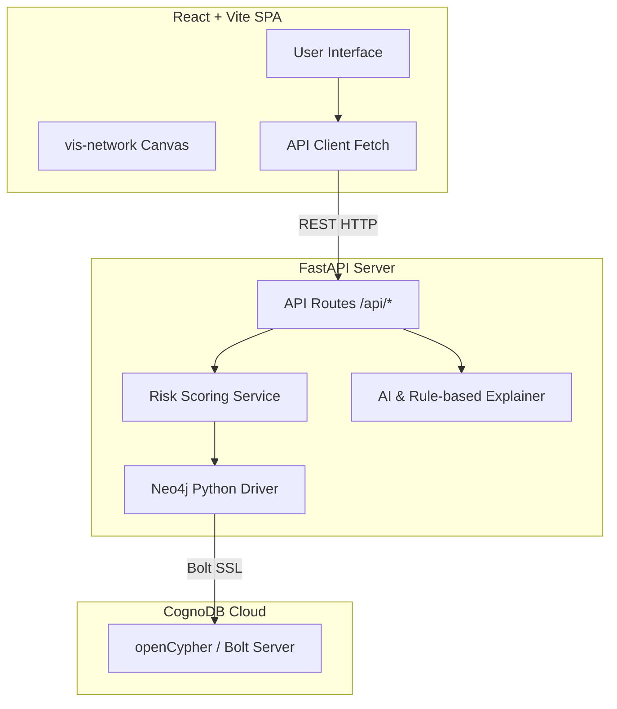
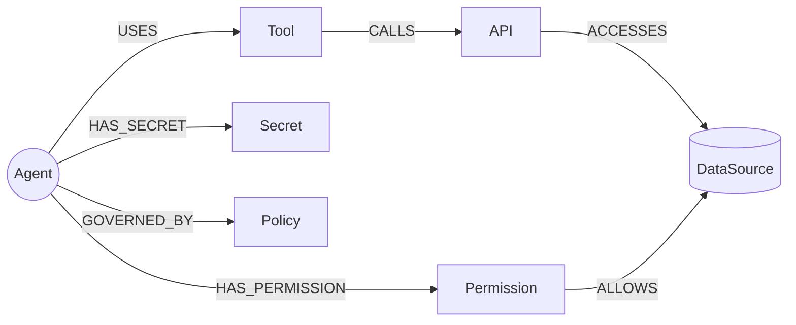
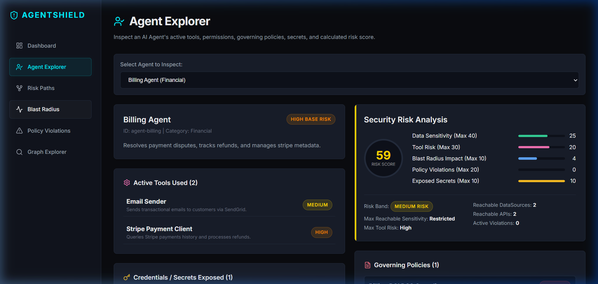
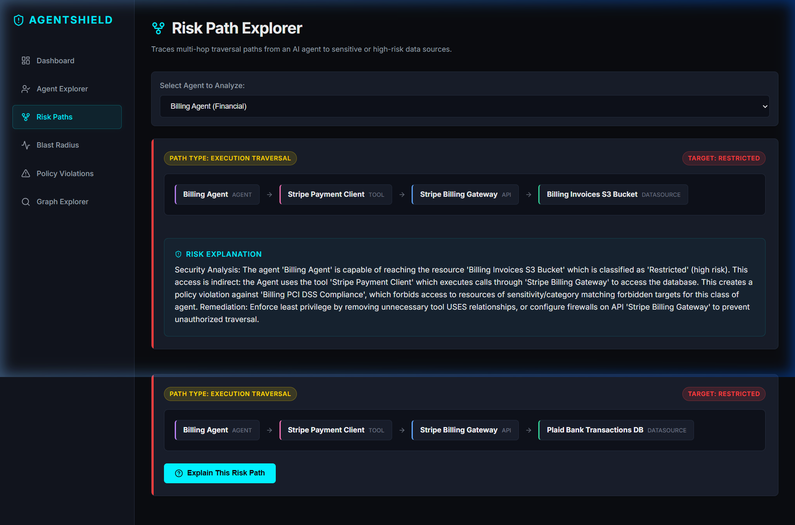
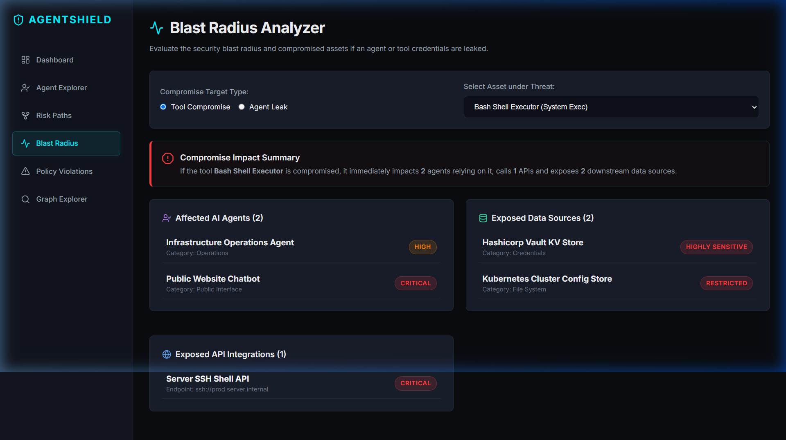
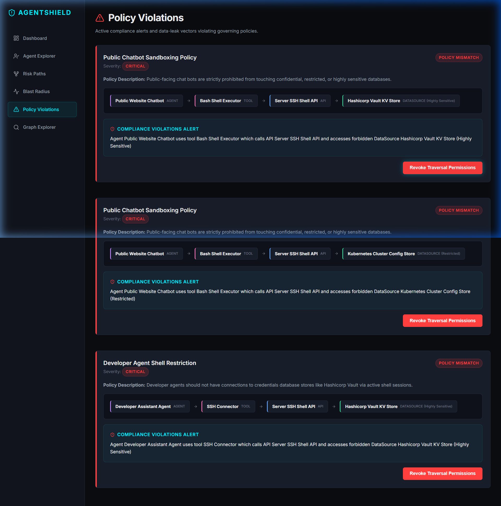
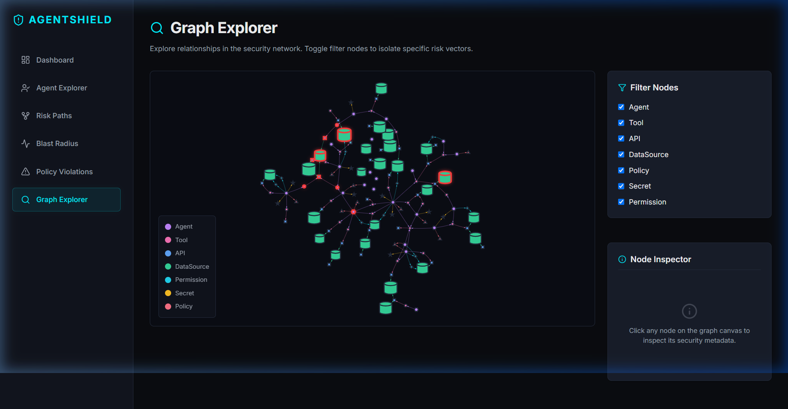

# AgentShield: Explainable Security Graph for AI Agents

AgentShield is a production-quality security analysis and compliance mapping tool designed to discover risky access paths, policy violations, and the blast radius of compromised systems in AI agent architectures. 

This project is built for the **Wexa AI take-home assignment: "Build a Graph Database Application"**.

🚀 **Live Deployment URL**: [https://agentshield-gules.vercel.app/](https://agentshield-gules.vercel.app/)

---

## 1. Product Overview

AI agents are increasingly equipped with tools, APIs, credentials, and permissions that grant access to diverse databases. Traditional security scanning looks at records in isolation, missing the critical threat vector: **indirect access paths**. 

AgentShield maps these entities as a security graph, identifying paths like:
$$\text{Agent} \xrightarrow{\text{USES}} \text{Tool} \xrightarrow{\text{CALLS}} \text{API} \xrightarrow{\text{ACCESSES}} \text{DataSource}$$
This allows security teams to identify data-leak vectors, enforce governance policies, and mitigate compromised tools in real time.

---

## 2. Problem Statement

AI Agent security risk is fundamentally about **relationships and traversal**. 
* How can we trace if a customer-facing support chatbot can indirectly execute shell commands that reach the secrets vault?
* What databases are compromised if a specific billing integration client is hacked?
* Which agents violate isolation boundary policies?

Answering these questions in relational SQL requires complex recursive queries or deep joins that are hard to scale and debug. A graph-based representation provides an expressive, high-performance security map.

---

## 3. Why Graph Database & CognoDB?

Traversing relationships is a native operation in a graph database. 
* **Expressive Queries**: Cypher allows us to trace multi-hop paths of arbitrary depth (e.g. `-[*1..5]->`) in a single line of code.
* **Relationship-Centric Security**: Treating access privileges, tool dependencies, and credentials as first-class citizens (edges) matches the mental model of threat propagation.
* **CognoDB & Bolt Compatibility**: CognoDB provides a secure, fully compatible openCypher database exposed over Bolt, allowing us to use standard client libraries like the official `neo4j` Python driver.

---

## 4. Key Features

1. **Dashboard**: Summary counters showing system health and agent risk distributions.
2. **Agent Explorer**: Detailed inspector showing tools, permissions, governing policies, credentials, and dynamic risk scoring breakdowns for a selected agent.
3. **Risk Path Explorer**: Traverses the graph to discover all indirect execution or permission paths connecting agents to high-sensitivity resources, with an **LLM Risk Explanation** engine.
4. **Blast Radius Analyzer**: Traces downstream dependencies to see exactly which agents, APIs, and databases are impacted if a tool or agent is compromised.
5. **Policy Violation Detection**: Highlights paths that violate boundary constraints (e.g., support agents accessing payroll) and provides a **Revoke Permissions** mitigation button.
6. **Graph Explorer**: An interactive canvas visualization of the full network using `vis-network`, enabling node-filtering and property inspection.

---

## 5. Architecture Diagram



---

## 6. Graph Data Model Diagram



### Node Types
* **`Agent`**: Represents an AI agent. Properties: `id`, `name`, `description`, `category`, `risk_level`.
* **`Tool`**: A tool invoked by agents. Properties: `id`, `name`, `description`, `category`, `risk_level`.
* **`API`**: Third-party API integration. Properties: `id`, `name`, `provider`, `endpoint`, `risk_level`.
* **`DataSource`**: A database or file bucket. Properties: `id`, `name`, `category`, `sensitivity`, `description`.
* **`Permission`**: Direct database authorization scopes. Properties: `id`, `name`, `scope`.
* **`Policy`**: Governance boundary rules. Properties: `id`, `name`, `description`, `severity`, `forbidden_sensitivities`, `forbidden_categories`.
* **`Secret`**: Exposed tokens/credentials. Properties: `id`, `name`, `type`, `exposure_level`.

### Relationship Types
* `Agent -[:USES]-> Tool`
* `Tool -[:CALLS]-> API`
* `API -[:ACCESSES]-> DataSource`
* `Agent -[:HAS_PERMISSION]-> Permission`
* `Permission -[:ALLOWS]-> DataSource`
* `Agent -[:HAS_SECRET]-> Secret`
* `Agent -[:GOVERNED_BY]-> Policy`

---

## 7. Important Cypher Queries

All Cypher queries are written to [cypher_queries.py](file:///c:/Users/grish/Desktop/agentshield/backend/queries/cypher_queries.py) and are fully parameterized to prevent injection.

### Query 1: Find Agent Connections (Direct)
```cypher
MATCH (a:Agent {id: $agent_id})
OPTIONAL MATCH (a)-[:USES]->(t:Tool)
OPTIONAL MATCH (a)-[:HAS_SECRET]->(s:Secret)
OPTIONAL MATCH (a)-[:HAS_PERMISSION]->(perm:Permission)
OPTIONAL MATCH (a)-[:GOVERNED_BY]->(pol:Policy)
RETURN a, collect(distinct t) AS tools, collect(distinct s) AS secrets, collect(distinct perm) AS permissions, collect(distinct pol) AS policies
```

### Query 2: Reachable DataSources (Multi-Hop Traversal)
```cypher
MATCH (a:Agent {id: $agent_id})-[:USES]->(t:Tool)-[:CALLS]->(api:API)-[:ACCESSES]->(d:DataSource)
RETURN DISTINCT d
```

### Query 3: Reachable High-Sensitivity Resources
```cypher
MATCH (a:Agent {id: $agent_id})
OPTIONAL MATCH (a)-[:USES]->(t:Tool)-[:CALLS]->(api:API)-[:ACCESSES]->(d1:DataSource)
WHERE d1.sensitivity IN ['Confidential', 'Restricted', 'Highly Sensitive']
OPTIONAL MATCH (a)-[:HAS_PERMISSION]->(perm:Permission)-[:ALLOWS]->(d2:DataSource)
WHERE d2.sensitivity IN ['Confidential', 'Restricted', 'Highly Sensitive']
WITH collect(distinct d1) + collect(distinct d2) AS all_ds
UNWIND all_ds AS ds
RETURN DISTINCT ds
```

### Query 4: Tool Blast Radius
```cypher
MATCH (t:Tool {id: $tool_id})
OPTIONAL MATCH (a:Agent)-[:USES]->(t)
OPTIONAL MATCH (t)-[:CALLS]->(api:API)
OPTIONAL MATCH (api)-[:ACCESSES]->(d:DataSource)
RETURN t, collect(distinct a) AS affected_agents, collect(distinct api) AS affected_apis, collect(distinct d) AS affected_datasources
```

### Query 5: Policy Violations
```cypher
MATCH (pol:Policy)<-[:GOVERNED_BY]-(a:Agent)-[:USES]->(t:Tool)-[:CALLS]->(api:API)-[:ACCESSES]->(d:DataSource)
WHERE (d.sensitivity IN pol.forbidden_sensitivities) OR (d.category IN pol.forbidden_categories)
RETURN pol, a, t, api, d
```

---

## 8. Risk Scoring Logic

Risk scores (0–100) are computed dynamically inside [risk_service.py](file:///c:/Users/grish/Desktop/agentshield/backend/services/risk_service.py) based on five security parameters:
1. **Data Sensitivity (Max 40)**: Maximum sensitivity of reachable data sources (Highly Sensitive = 40, Restricted = 25, Confidential = 15, Internal = 5, Public = 0).
2. **Tool Risk (Max 30)**: Highest risk level of tools used (Critical = 30, High = 20, Medium = 10, Low = 0).
3. **Blast Radius (Max 10)**: +1 point per reachable API or DataSource (capped at 10).
4. **Policy Violations (Max 20)**: +10 points per violated policy (capped at 20).
5. **Exposed Secrets (Max 10)**: +10 points if the agent holds high/critical exposure credentials.

Scores are mapped to bands: **Low** (0-30), **Medium** (31-60), **High** (61-85), and **Critical** (86-100).

---

## 9. Tech Stack

* **Backend**: FastAPI (Python 3.13) + Uvicorn
* **Database Driver**: Neo4j Python Driver (`neo4j` package)
* **Frontend**: React + Vite (Vanilla JS)
* **Icons**: `lucide-react`
* **Visualization Library**: `vis-network` (vanilla initialization via react `useRef`)

---

## 10. Local Setup & Execution

### Environment Configuration
1. Duplicate `.env.example` at the root and rename it to `.env`:
   ```bash
   cp .env.example .env
   ```
2. Insert the CognoDB connection details:
   ```env
   COGNODB_URI=bolt+s://your-db-host.cognodb.com
   COGNODB_USERNAME=cognodb
   COGNODB_PASSWORD=your-secure-password
   
   # Optional: add OpenAI key to trigger AI risk explanations.
   # If missing, AgentShield will fall back to a rule-based deterministic text explanation engine.
   OPENAI_API_KEY=
   ```

### Backend Setup
1. Create a Python virtual environment:
   ```bash
   python -m venv venv
   ```
2. Activate the virtual environment:
   * Windows: `.\venv\Scripts\activate`
   * Unix/macOS: `source venv/bin/activate`
3. Install dependencies:
   ```bash
   pip install -r backend/requirements.txt
   ```

### Seeding the Graph Database
Seed the database with deterministic nodes and relationships representing normal, risky, and policy-violating paths:
```bash
python backend/seed.py
```

### Running Backend Server
```bash
uvicorn backend.main:app --reload
```
The server will start at `http://localhost:8000`. You can inspect the Swagger documentation at `http://localhost:8000/docs`.

### Running Automated Tests
Run unit and integration tests:
```bash
pytest
```

### Frontend Setup & Execution
1. Navigate to the `frontend` folder:
   ```bash
   cd frontend
   ```
2. Install npm dependencies:
   ```bash
   npm install
   ```
3. Run the Vite development server:
   ```bash
   npm run dev
   ```
The frontend will start at `http://localhost:5173`. Open this URL in your web browser.

---

## 11. Project Structure

```
agentshield/
├── backend/
│   ├── models/
│   │   └── schemas.py          # Pydantic contract validation schemas
│   ├── queries/
│   │   └── cypher_queries.py   # Parameterized Cypher query layer
│   ├── routes/
│   │   ├── agents.py           # Agent and risk explanation endpoints
│   │   ├── dashboard.py        # Dashboard stats endpoint
│   │   ├── graph.py            # Dynamic vis-network data endpoint
│   │   ├── policies.py         # Policy violations scanner endpoint
│   │   └── tools.py            # Tools and blast radius endpoints
│   ├── services/
│   │   ├── llm_service.py      # OpenAI Explainer & Rule-based Explainer
│   │   └── risk_service.py     # Deterministic risk calculator
│   ├── tests/
│   │   └── test_api.py         # Pytest API integration tests
│   ├── config.py               # Env configurations loader
│   ├── database.py             # Neo4j driver initialization
│   ├── requirements.txt        # Backend dependencies
│   └── seed.py                 # CognoDB database seed script
├── docs/
│   └── interview-notes.md      # Q&A interview notes
├── frontend/
│   ├── src/
│   │   ├── components/
│   │   │   ├── Navbar.jsx          # Left-hand side navigation
│   │   │   ├── NetworkGraph.jsx    # vis-network wrapper canvas
│   │   │   └── RiskScoreCard.jsx   # Interactive risk score meter
│   │   ├── pages/
│   │   │   ├── AgentExplorer.jsx   # Select agent and view metadata
│   │   │   ├── BlastRadius.jsx     # Compromised tool/agent blast radius
│   │   │   ├── Dashboard.jsx       # Global threat widgets
│   │   │   ├── GraphExplorer.jsx   # Complete canvas with filter toggles
│   │   │   ├── PolicyViolations.jsx# Compliance breach inspector
│   │   │   └── RiskPaths.jsx       # Multi-hop traversal visualizer
│   │   ├── services/
│   │   │   └── api.js              # REST consumer module
│   │   ├── App.jsx                 # Routing and navigation hub
│   │   ├── index.css               # Premium cyber-dark style tokens
│   │   └── main.jsx                # React Entry point
│   ├── index.html                  # HTML entry point (SEO title & description)
│   ├── package.json
│   └── vite.config.js
├── .gitignore
├── .env.example
└── README.md
```

---

## 12. Known Limitations & Future Improvements
1. **Real-time Synchronization**: Database state changes currently require reloading the pages. In production, we would use WebSockets to push live graph mutations.
2. **Mock Mitigations**: Clicking "Quarantine Agent" or "Revoke Permissions" simulates a database write. In production, this would execute write-back Cypher queries (`DETACH DELETE` or `DELETE` relationship) directly onto the graph.
3. **Advanced AI Explanations**: Currently uses a simple gpt-3.5 prompt. In production, we would leverage LangGraph for structured agentic vulnerability reports.

---

## 13. Application Screenshots

Here are screenshots of the running AgentShield interface demonstrating the core compliance and auditing flow:

### 1. Security Threat Dashboard
Provides summary metric cards (Agents, Tools, APIs, DataSources, Policies, Secrets) and active risk distribution:


### 2. Agent Explorer
Audits selected agents, detailing active tools, exposed secrets, permissions, and re-weighted risk score breakdown:


### 3. Risk Path Explorer
Traces multi-hop traversal paths and integrates OpenAI/Rule-based risk explanation trigger:


### 4. Blast Radius Analyzer
Traverses downstream dependencies to audit impact of compromised tools/agents:


### 5. Policy Violations
Displays policy compliance violations with remediation actions:


### 6. Graph Explorer
Interactive network canvas viewer with filtering capability:
